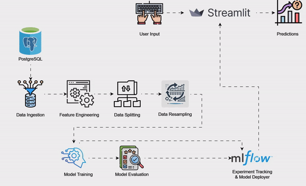
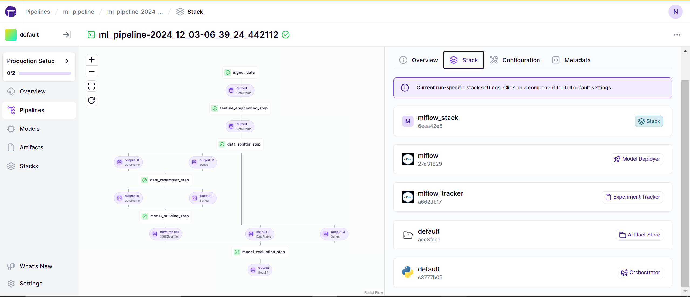
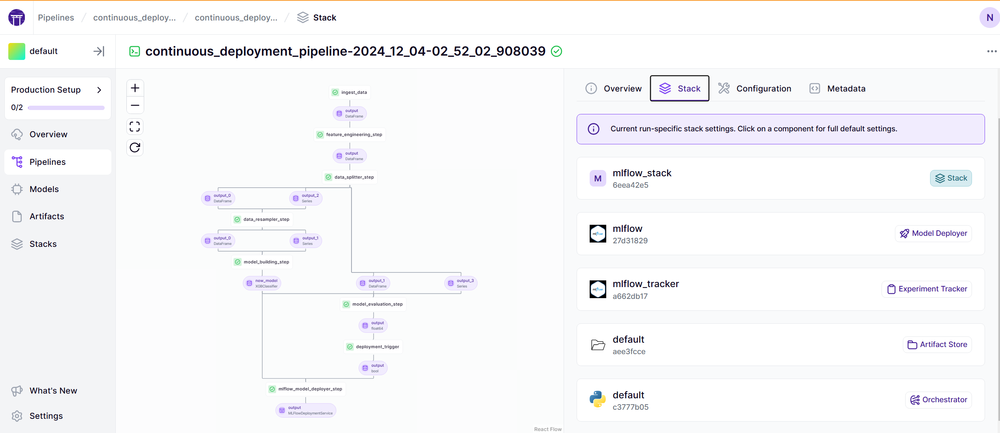
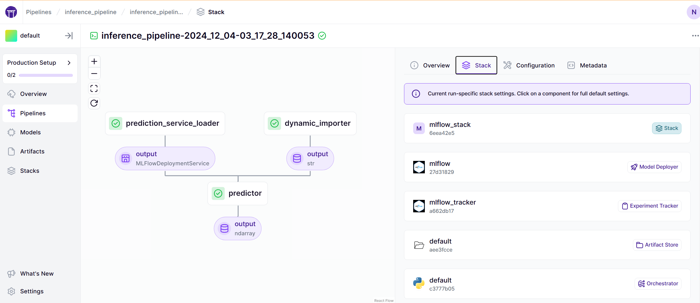
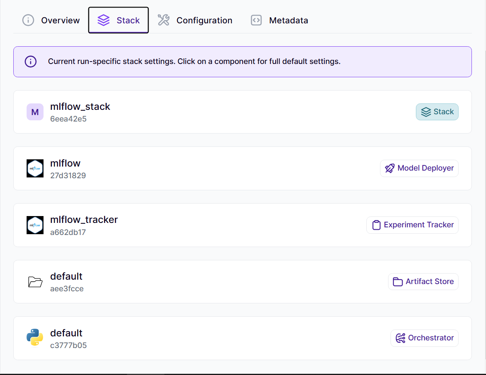
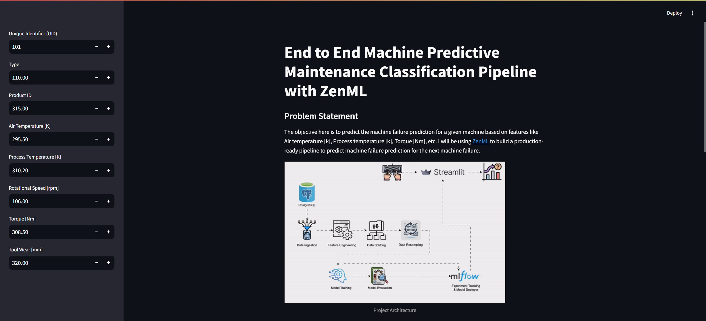
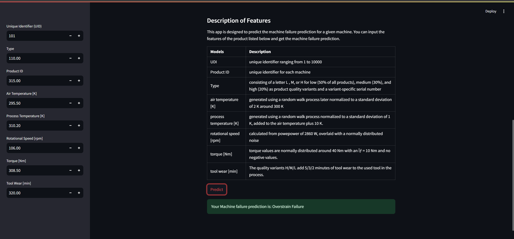

# Machine Predictive Maintenance Classification - MLOps Project



## Project Overview 
This project automates machine predictive maintenance classification to predict whether a machine will fail or not as **No Failure** and the type of failure that will occur as **Heat Dissipation Failure** or **Power Failure** or **Overstrain Failure** or **Tool Wear Failure** or **Random Failures**, helping businesses understand feedback effectively while ensuring accurate model deployment and real-time predictions through cutting-edge **MLOps tools**. It integrates powerful tools like **ZenML** for pipeline management, **MLflow** for model deployment and experiment tracking, **PostgreSQL** for data ingestion, and **Streamlit** for an interactive interface, ensuring efficiency and scalability.

## The Solution

In order to build a real-world workflow for predicting the machine failure prediction for the next machine failure (which will help make better decisions), it is not enough to just train the model once.

Instead, we are building an end-to-end pipeline for continuously predicting and deploying the machine learning model, alongside a data application that utilizes the latest deployed model for the business to consume.

This pipeline can be deployed to the cloud, scale up according to our needs, and ensure that we track the parameters and data that flow through every pipeline that runs. It includes raw data input, features, results, the machine learning model and model parameters, and prediction outputs. ZenML helps us to build such a pipeline in a simple, yet powerful, way.

In this Project, we give special consideration to the [MLflow integration](https://github.com/zenml-io/zenml/tree/main/examples) of ZenML. In particular, we utilize MLflow tracking to track our metrics and parameters, and MLflow deployment to deploy our model. We also use [Streamlit](https://streamlit.io/) to showcase how this model will be used in a real-world setting

**It features:**

- A **Training Pipeline** that ingests data, preprocess it, trains the model, and evaluates the results.
- A **Continuous Deployment Pipeline** that trains and (re)deploys the model automatically.
- An **Inference Pipeline** that enables real-time machine failure predictions through a user-friendly Streamlit interface.

## Deployment Pipelines ⚙

### 1. **Training Pipeline** 🚂
Our standard training pipeline consists of several steps:

- **ingest_data**: Fetches data from a PostgreSQL table into a pandas DataFrame.
- **feature_engineering_step**: The label encoding feature engineering technique is used to encode the categorical features into numerical features.
- **data_splitter_step**: This step splits the dataset into training and testing subsets.
- **data_resampling_step**: This step balances the imbalanaced y_train dataset by sampling an equal number data points for each class in y_train.
- **model_training_step**: This step will train the model and save the model using [MLflow autologging](https://www.mlflow.org/docs/latest/tracking.html).
- **model_evaluation_step**: This step will evaluate the model and save the metrics using **MLflow autologging** into the artifact store.



### 2. **Continuous Deployment Pipeline** 🔄
This pipeline automates the process of deploying the model to production. It ensures the entire workflow — from training to deployment — is smooth, efficient and scalable. Key features include:

- **Training Pipeline Integration**: Automatically integrates with the training pipeline to retrieve the latest trained model.  
- **Model Deployment**: Deploys the trained model using the **MLflow model deployer step**, with multiple workers to ensure scalability.  
- **Automatic Updates**: Monitors and redeploys models when needed, keeping the production environment up-to-date with the best-performing version.




### 3. **Inference Pipeline** 🧠

The inference pipeline is designed to generate predictions using the deployed model service. It enables real-time or batch predictions with new data. Key features include:

- **Dynamic Data Import**: Uses a `dynamic_importer` step to load new data from external sources, such as APIs.  
- **Model Service Loader**: Retrieves the deployed model service from **MLflow** to ensure predictions are based on the most recent deployment.  
- **Batch Inference**: Processes the input data through the `predictor` step, generating predictions quickly and efficiently.  




## Tech Stack 🛠️
- **PostgreSQL**: Ensures robust and efficient data ingestion and management.
- **ZenML**: Manages MLOps pipelines for seamless integration and automation.
- **MLflow**: Handles experiment tracking and deploys the trained models effortlessly.
- **Streamlit**: Powers the front end, offering an intuitive and interactive user interface.

### Using MLFlow for Model Deployer & Experiment Tracker with ZenML


### Streamlit



## Local Setup 👨🏼‍💻
1. **Clone the Repository**:
```bash
git clone https://github.com/Neeraj876/predictive-maintenance-mlops.git
cd predictive-maintenance-mlops
```

2. **Set Up a Virtual Environment**:
```bash
# For macOS and Linux:
python3 -m venv venv

# For Windows:
python -m venv venv
```

3. **Activate the Virtual Environment**:
```bash
# For macOS and Linux:
source venv/bin/activate

# For Windows:
.\venv\Scripts\activate
```

4. **Install Required Dependencies**:
```bash
pip install -r requirements.txt
```

## Zenml Integration 💥
1. Install ZenML - https://docs.zenml.io/getting-started/installation 

2. Install some integrations using ZenML:
```bash
zenml integration install mlflow -y
```

3. Register mlflow in the stack:
```bash
zenml integration install mlflow -y
zenml experiment-tracker register mlflow_tracker --flavor=mlflow
zenml model-deployer register mlflow --flavor=mlflow
zenml stack register local-mlflow-stack -a default -o default -d mlflow -e mlflow_tracker --set
```

## Running the Project 🏃‍➡️

Follow these steps to run different components of the project:

1. **Training Pipeline**:
   
   ```bash
    python run_pipeline.py
    ```

2. **Continuous Integration Pipeline**:

   ```bash
    python run_deployment.py --config deploy
    ```

3. **Inference Pipeline**:

   ```bash
    python run_deployment.py --config predict
    ```

4. **Streamlit**:

   ```bash
    streamlit run streamlit_app.py
    ``` 
